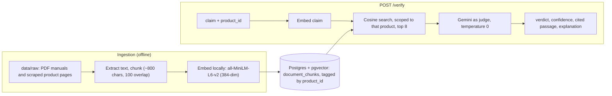
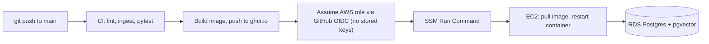

# RAG Claim Verifier

[](https://github.com/haritaparikh05/rag-claim-verifier/actions/workflows/ci.yml)

Given a product claim (for example "waterproof to 30 meters", "BPA-free", "12-hour battery life") and a product's official documentation, this system returns a verdict - **supported**, **contradicted**, or **unverifiable** - backed by the exact passage it is grounding the answer in.

It is deliberately a **verification task, not a chatbot**: the model is given a claim plus retrieved evidence and must classify whether the evidence supports it, instead of writing a free-form answer that might hallucinate. That makes the output checkable (every verdict points at a quoted passage) and measurable (it is a classification problem with ground truth).

```
POST /verify
{"product_id": "jbl_flip_6", "claim": "IP67 waterproof and dustproof"}

{
  "verdict": "supported",
  "confidence": 1.0,
  "cited_passage": "IP67 waterproof and dustproof",
  "explanation": "The official documentation explicitly states that the JBL Flip 6 is 'IP67 waterproof and dustproof'."
}
```

The other two verdicts, for the same product. A claim the documentation contradicts:

```
{"product_id": "jbl_flip_6", "claim": "24 hours of battery life"}

{
  "verdict": "contradicted",
  "confidence": 1.0,
  "cited_passage": "Music play time: up to 12 hours (dependent on volume level and audio content)",
  "explanation": "The documentation states that the battery life is up to 12 hours, which directly contradicts the claim of 24 hours."
}
```

And a claim the documentation never addresses, which is reported as unverifiable instead of guessed at:

```
{"product_id": "jbl_flip_6", "claim": "has a built-in flashlight"}

{
  "verdict": "unverifiable",
  "confidence": 1.0,
  "cited_passage": "",
  "explanation": "The provided documentation makes no mention of whether the product has a built-in flashlight."
}
```

## How it works



1. **Ingestion** (`ingestion/ingest.py`) extracts text from PDFs (`pypdf`) and saved web pages, chunks it with custom logic, embeds each chunk locally, and stores it in Postgres with pgvector, tagged by `product_id`.
2. **Retrieval** (`app/retrieval.py`) embeds the claim and runs a cosine-similarity search restricted to **one product's chunks** (`WHERE product_id = ...`), returning the top 8.
3. **Verdict** (`app/verdict.py`) is an LLM-as-judge step: claim plus retrieved passages in, structured JSON out (`verdict`, `confidence`, `cited_passage`, `explanation`).
4. **API** (`app/main.py`) is a FastAPI service exposing `POST /verify` and `GET /health`.

## Results

Two independent evaluations, deliberately kept separate because they test different things.

| Evaluation | What it tests | Result |
|---|---|---|
| Hand-verified product set (`eval/run_eval.py`, 27 cases) | The full pipeline (retrieval + verdict) against this project's real documents: one true, one false and one unverifiable claim per product | **27 / 27 (100%)** |
| FEVER benchmark sample (`eval/run_fever_eval.py`, 300 examples per run) | Whether the judge logic generalizes to independently labeled data (retrieval is bypassed, since FEVER claims are not about these products) | **75.67%, 75.33%, 74.33%** on three random samples (seeds 42, 777, 2024) |

How to read these honestly:
- The 27-case set is small and written by the project author, so it is a regression check for the pipeline, not a general accuracy claim.
- FEVER measures generic Wikipedia claims, so it is a transfer check of the judging logic, not product accuracy. Tuning stopped once changes were indistinguishable from run-to-run noise (about 1 point); a further change was only accepted if it held on a fresh, unseen seed.

## Design decisions

- **Local embeddings.** `sentence-transformers` (`all-MiniLM-L6-v2`) runs on the machine for both ingestion and query time: free, no rate limits, no API key for that half of the pipeline.
- **Pinned Gemini model, temperature 0.** The verdict model is `gemini-3.5-flash-lite`, pinned rather than a `-latest` alias (the alias pointed at a model with a 20-requests-per-day free quota). It is a fast classification task with one right answer, so temperature 0 and a light model fit.
- **Custom chunking.** Written from scratch (not a library splitter) so the behavior is explainable: about 800 characters with 100 of overlap, and a new chunk starts at every all-caps section header so a spec table is not diluted by unrelated text.
- **Multi-language manuals.** Some PDFs repeat instructions in about 24 languages. The English section is kept whole, and in other languages only non-prose lines (icon legends, numeric spec tables) survive, using a line-level filter. A whole-segment "drop by language" rule wrongly deleted spec data that sits under a foreign-language marker purely because of page layout.
- **Prompt rules found by failing.** The judge prompt contains explicit rules added after real misclassifications: threshold reasoning ("at least 1.1 m" supports a claim of 1 m), "a passage must address the same attribute, not just share a keyword", and "do not use outside world knowledge". Each came from a concrete failing case.
- **Retrieval depth of 8, not 5.** Raised after a regression where the correct chunk ranked sixth.
- **Verified, not trusted.** The HuggingFace dataset card for the FEVER data had its field mapping backwards; the mapping used here was checked against the actual rows.

## Run it locally

Prerequisites: Python 3.11+, Docker, and a free Gemini API key from Google AI Studio.

```bash
git clone https://github.com/haritaparikh05/rag-claim-verifier.git
cd rag-claim-verifier
python3 -m venv venv
./venv/bin/pip install -r requirements.txt

cp .env.example .env          # then put your Gemini key in GEMINI_API_KEY

docker compose up -d db       # Postgres with pgvector
./venv/bin/python -m ingestion.ingest   # chunk, embed and load data/raw (about a minute)
./venv/bin/uvicorn app.main:app --port 8000
```

Try it:

```bash
curl -s -X POST localhost:8000/verify \
  -H "Content-Type: application/json" \
  -d '{"product_id": "jbl_flip_6", "claim": "IP67 waterproof and dustproof"}'
```

Available `product_id` values:

| Category | `product_id` | Source |
|---|---|---|
| Outdoor gear | `alps_helix_2` (ALPS Helix 2-person tent) | scraped product page |
| Outdoor gear | `black_diamond_spot_400` (Spot 400 headlamp) | official PDF manual and product page |
| Outdoor gear | `nalgene_32oz_wide_mouth` (32 oz bottle) | scraped product page |
| Electronics | `jbl_flip_6` (Flip 6 speaker) | official spec sheet PDF |
| Electronics | `anker_313_powercore_10k` (313 power bank) | scraped product page |
| Electronics | `soundcore_life_q20` (Life Q20 headphones) | scraped product page |
| Kitchen | `instant_pot_duo` (Duo 7-in-1) | official PDF manual |
| Kitchen | `philips_airfryer_hd9252` (Airfryer L) | official PDF manual |
| Kitchen | `ninja_blender_bl621` (Professional blender BL621) | official PDF manual |

All sources are publicly available manufacturer documentation, used for a personal, non-commercial project.

## API

**`POST /verify`** - body: `product_id` (string) and `claim` (string). Returns `verdict` (`supported`, `contradicted` or `unverifiable`), `confidence` (0 to 1), `cited_passage` (exact quoted text, empty when unverifiable) and `explanation` (one sentence). Missing fields return `422`.

**`GET /health`** - checks that the service can actually reach and query the database. Returns `200 {"status": "ok", "database": "ok"}`, or `503 {"status": "degraded", "database": "unreachable"}`.

Every response carries an `x-request-id` header (an incoming one is honored), and the same ID appears in the logs.

## Tests and evaluation

```bash
./venv/bin/python -m pytest                 # 33 tests
./venv/bin/python -m eval.run_eval          # the 27-case product eval (uses the Gemini API)
./venv/bin/python -m eval.run_fever_eval --seed 42   # FEVER sample (hundreds of Gemini calls)
```

The test suite covers the ingestion logic (including regression tests for the multi-language and chunking bugs), retrieval against a real Postgres, the verdict step with Gemini mocked, and the API. The model is mocked in tests, so the suite never spends API quota; model quality is measured separately by the evals above.

## CI/CD and deployment

On every push and pull request, GitHub Actions lints with `ruff`, starts a real `pgvector` Postgres service, loads the schema, ingests the product documents, and runs the full test suite. On a push to `main` that passes, a second job builds the Docker image, pushes it to GitHub's container registry, and deploys it.



- **No long-lived secrets in CI.** The deploy job authenticates to AWS with short-lived GitHub OIDC tokens, and the role it assumes can only run commands on one instance and only from this repository's `main` branch.
- **No open SSH port.** The deploy goes through AWS Systems Manager, so the server has no inbound SSH exposure for automation.
- **Where things run.** The app runs in a Docker container on an EC2 instance, backed by RDS Postgres with pgvector, with raw source documents kept in a private S3 bucket. The project is sized to stay within AWS free-tier credits.
- **Observability.** The API writes one JSON log line per event (including a `verify` record with product, verdict, confidence, chunks retrieved and latency), which made it easy to see that the Gemini call, not retrieval, dominates latency.

## Known limitations

- **Small corpus and small eval.** Nine products and 373 chunks. The 27-case eval is hand-written by the author and is a regression check, not a benchmark.
- **The judge is an LLM.** Quality depends on a hosted model. During development, an unchanged prompt and unchanged data started misclassifying one case after an upstream model update (the pipeline dropped from 100% to 96.3% until the prompt was tightened). Pinning a model name does not freeze its behavior.
- **Latency and quotas.** On the free tier, the time for one `/verify` call varies widely (from about 1 second to over 20 seconds in testing), and almost all of it is the Gemini call, not retrieval. The daily quota is also limited.
- **Retail-page noise.** Four products come from scraped web pages that include navigation, pricing and reviews; retrieval usually still surfaces the right passage, but the chunks are noisier than the PDF manuals.
- **No authentication or rate limiting on `/verify`.** The deployed instance is restricted by a firewall to the author's IP address and is not a public service. Adding an API key and a rate limit is the next hardening step before any public demo.
- **Single instance, no load balancer or HTTPS.** The instance is stopped when idle to conserve credits, so there is no always-on public demo.
- **Simple retrieval.** Fixed top-k with no reranking or hybrid search, and one product per request. Claims that depend on combining facts across products are out of scope.
- **Manual ingestion.** Ingestion is a command run by hand against local files; the S3 bucket holds a copy but is not wired into the pipeline.

## Repository layout

```
app/          FastAPI app: main.py (API), retrieval.py, verdict.py, logging_config.py
ingestion/    ingest.py (extract, chunk, embed, store) and inspect_db.py (checks the database)
eval/         run_eval.py (27-case set), run_fever_eval.py (FEVER sample), metrics.py
tests/        pytest suite
data/raw/     source documents, one folder per product
data/eval/    eval set and committed result files
docker/       init.sql (pgvector extension and table schema)
.github/      CI/CD workflow
```
